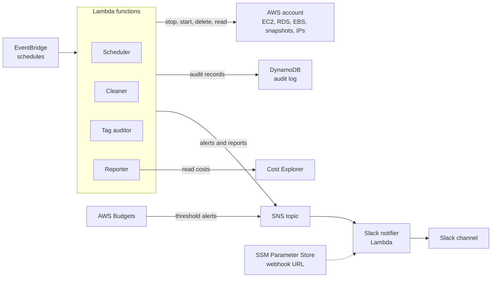
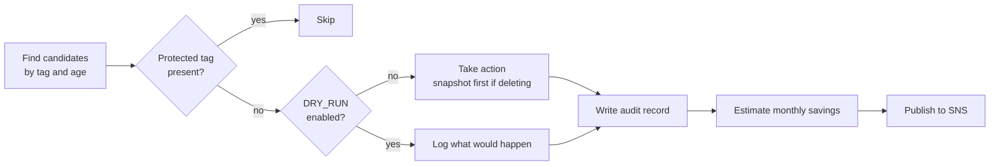
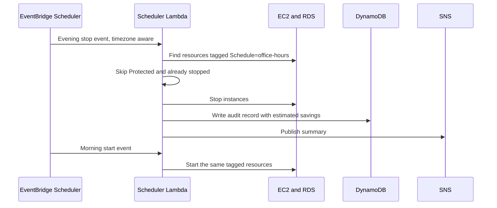
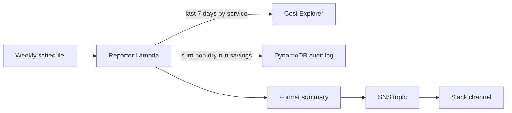

# AWS Cost Optimizer: Serverless Cost Automation

A serverless automation platform that reduces AWS spend. Scheduled Lambda functions stop idle non-production resources outside working hours, clean up orphaned resources (unattached EBS volumes, old snapshots, unused Elastic IPs), audit missing cost-allocation tags, and post a weekly savings report to Slack. Everything is provisioned with Terraform and tested in CI.

> **Status:** design and build guide. See [Project status](#3-project-status) for what is implemented. Always run this in your own sandbox account first, never in an account you do not own.

## Table of contents

1. [Overview and tool stack](#1-overview-and-tool-stack)
2. [Architecture](#2-architecture)
3. [Project status](#3-project-status)
4. [Repository layout](#4-repository-layout)
5. [Prerequisites](#5-prerequisites)
6. [Step-by-step build guide](#6-step-by-step-build-guide)
7. [Configuration reference](#7-configuration-reference)
8. [Safety guardrails](#8-safety-guardrails)
9. [IAM permissions per function](#9-iam-permissions-per-function)
10. [Savings estimation](#10-savings-estimation)
11. [Cost and cleanup](#11-cost-and-cleanup)
12. [Troubleshooting](#12-troubleshooting)
13. [Roadmap](#13-roadmap)
14. [Interview questions](#14-interview-questions)

---

## 1. Overview and tool stack

| Area | Tool | Purpose |
|---|---|---|
| Compute | AWS Lambda (Python 3.12) | Runs each optimization job |
| Scheduling | Amazon EventBridge Scheduler | Cron triggers, timezone aware |
| Audit log | Amazon DynamoDB | Records every action and its estimated saving |
| Notifications | Amazon SNS and a Slack notifier Lambda | Alerts and reports |
| Secrets | SSM Parameter Store (SecureString) | Stores the Slack webhook URL |
| Cost data | AWS Cost Explorer API | Weekly spend by service |
| Budgets | AWS Budgets | Threshold alerts at 80% and 100% |
| Infrastructure as code | Terraform (remote state in S3) | Provisions everything |
| Testing | pytest and moto | Unit tests with mocked AWS |
| CI | GitHub Actions | Format, validate, security scan, test |
| Security scan | Checkov | Scans Terraform for misconfigurations |

### What it automates

| Function | Schedule | Job |
|---|---|---|
| Scheduler | Evening and morning | Stops EC2 and RDS resources tagged `Schedule=office-hours` after hours, starts them again in the morning |
| Cleaner | Daily | Finds unattached EBS volumes, old unreferenced snapshots, and unassociated Elastic IPs |
| Tag auditor | Weekly | Lists resources missing required cost-allocation tags |
| Reporter | Weekly | Summarizes last week's cost by service and the savings achieved, then posts to Slack |

---

## 2. Architecture

### 2.1 System overview



### 2.2 Safe execution pipeline (shared by every function)

Every function that changes something follows the same pipeline, so a mistake is caught before it can delete anything.



### 2.3 Off-hours scheduler sequence



### 2.4 Weekly report flow



---

## 3. Project status

- [x] Architecture and safety design
- [ ] **Phase 0:** Sandbox account, billing alert, Terraform remote state
- [ ] **Phase 1:** Report-only cleaner Lambda with schedule
- [ ] **Phase 2:** Cleanup actions, DynamoDB audit log, SNS and Slack
- [ ] **Phase 3:** Off-hours scheduler for EC2 and RDS
- [ ] **Phase 4:** Tag auditor and weekly Cost Explorer report
- [ ] **Phase 5:** AWS Budgets, unit tests, GitHub Actions CI
- [ ] **Phase 6:** Run for a week, record measured savings, add screenshots

---

## 4. Repository layout

```
aws-cost-optimizer/
├── README.md
├── requirements-dev.txt
├── terraform/
│   ├── backend.tf              # S3 remote state
│   ├── versions.tf
│   ├── main.tf                 # wires the modules together
│   ├── variables.tf
│   ├── outputs.tf
│   └── modules/
│       ├── lambda_function/    # reusable: IAM role, log group, function, schedule
│       ├── dynamodb/           # audit table
│       ├── notifications/      # SNS topic, Slack notifier, SSM parameter reference
│       └── budgets/            # AWS Budgets and alerts
├── src/
│   ├── scheduler/handler.py
│   ├── cleaner/handler.py
│   ├── tag_auditor/handler.py
│   ├── reporter/handler.py
│   ├── slack_notifier/handler.py
│   └── common/                 # logging, tag rules, pricing, audit and SNS helpers
├── tests/                      # pytest with moto
├── docs/
│   └── images/                 # screenshots of Slack reports and dashboards
└── .github/
    └── workflows/
        └── ci.yml              # fmt, validate, checkov, pytest
```

The `lambda_function` module is reused four times with different inputs (name, handler, schedule, permissions). Reusable modules are the core Terraform skill this project demonstrates.

---

## 5. Prerequisites

- An AWS account you own, with a **billing alert** configured
- [AWS CLI](https://docs.aws.amazon.com/cli/) configured with `aws configure`
- [Terraform](https://developer.hashicorp.com/terraform/install) **1.10 or newer** (needed for S3 native state locking)
- Python 3.12 and `pip`
- Git and a GitHub account
- A Slack workspace where you can create an incoming webhook

```bash
aws sts get-caller-identity     # confirm you are logged in to the right account
terraform version
python3 --version
```

---

## 6. Step-by-step build guide

### Phase 0: Sandbox and remote state

Create an S3 bucket for Terraform state (bucket names are globally unique; for `us-east-1`, omit the `--create-bucket-configuration` flag):

```bash
aws s3api create-bucket --bucket <unique-name>-tfstate --region <region> \
  --create-bucket-configuration LocationConstraint=<region>

aws s3api put-bucket-versioning --bucket <unique-name>-tfstate \
  --versioning-configuration Status=Enabled
```

`terraform/backend.tf`:

```hcl
terraform {
  backend "s3" {
    bucket       = "<unique-name>-tfstate"
    key          = "aws-cost-optimizer/terraform.tfstate"
    region       = "<region>"
    use_lockfile = true
    encrypt      = true
  }
}
```

Store the Slack webhook in Parameter Store so it never appears in code or Terraform state:

```bash
aws ssm put-parameter --name /cost-optimizer/slack-webhook \
  --type SecureString --value "https://hooks.slack.com/services/XXX/YYY/ZZZ"
```

Create a few throwaway resources to test against:

```bash
# unattached 1 GiB volume (opted in to automation)
aws ec2 create-volume --availability-zone <az> --size 1 --volume-type gp3 \
  --tag-specifications 'ResourceType=volume,Tags=[{Key=AutoOptimize,Value=true},{Key=Owner,Value=me}]'

# unassociated Elastic IP
aws ec2 allocate-address --domain vpc \
  --tag-specifications 'ResourceType=elastic-ip,Tags=[{Key=AutoOptimize,Value=true}]'

# small instance on an office-hours schedule
aws ec2 run-instances --image-id <ami-id> --instance-type t3.micro \
  --tag-specifications 'ResourceType=instance,Tags=[{Key=Schedule,Value=office-hours},{Key=AutoOptimize,Value=true}]'
```

**Done when:** you can run `terraform init` against the remote backend and the test resources exist.

### Phase 1: Report-only cleaner

Write the cleaner Lambda so it only lists unattached volumes (`status=available`) and logs them, with `DRY_RUN=true`. Deploy it with the `lambda_function` module and one EventBridge schedule.

```bash
cd terraform
terraform init
terraform plan  -var="dry_run=true"
terraform apply -var="dry_run=true"
```

A brand-new test volume will not be reported until it is older than `ORPHAN_GRACE_DAYS` (default 7). To see results right away while testing, deploy with a zero grace period:

```bash
terraform apply -var="dry_run=true" -var="orphan_grace_days=0"
```

Helper scripts create and remove tagged test resources for you (an idle Elastic IP costs about $3.65 per month, so delete it when you are done):

```bash
./scripts/create-test-resources.sh <region>
./scripts/delete-test-resources.sh <region>
```

Invoke it by hand and read the logs:

```bash
aws lambda invoke --function-name cost-optimizer-cleaner \
  --payload '{}' --cli-binary-format raw-in-base64-out out.json
cat out.json
aws logs tail /aws/lambda/cost-optimizer-cleaner --follow
```

**Done when:** the logs list your test volume and nothing is deleted.

### Phase 2: Actions, audit log, notifications

Add these behaviors to the cleaner, each guarded by the safety pipeline in [section 2.2](#22-safe-execution-pipeline-shared-by-every-function):

- Snapshot then delete unattached volumes older than the grace period
- Release unassociated Elastic IPs
- Delete snapshots older than the retention period that no AMI references

Write each result to the DynamoDB audit table, publish a summary to SNS, and deploy the Slack notifier Lambda subscribed to the topic.

Check the audit table:

```bash
aws dynamodb scan --table-name cost-optimizer-audit --max-items 10
```

**Done when:** a dry-run cycle produces audit records and a Slack message.

### Phase 3: Off-hours scheduler

The scheduler stops and starts EC2 and RDS resources tagged `Schedule=office-hours`. Use two EventBridge Scheduler schedules (stop and start) with an explicit timezone.

Points to handle in code:
- Skip resources tagged `Protected=true` and those already in the target state
- Instances with instance-store volumes cannot be stopped, so skip and report them
- A stopped RDS instance is started automatically by AWS after 7 days, so the scheduler must re-stop it when needed

**Done when:** your test instance stops in the evening and starts in the morning without manual action.

### Phase 4: Tag auditor and weekly report

- **Tag auditor:** use the Resource Groups Tagging API to find resources missing `Owner`, `Environment`, or `Project`.
- **Reporter:** call Cost Explorer for the last 7 days grouped by service, add up non-dry-run savings from the audit table, and publish a summary.

Cost Explorer must be enabled in the account, and newly activated cost-allocation tags can take up to 24 hours to appear.

Example Slack report:

```
Weekly AWS cost report (Mon 1 - Sun 7)
Total spend: $42.18   (previous week: $47.90, -11.9%)
Top services: EC2 $18.40 | RDS $9.72 | EBS $4.10 | Data transfer $2.85

Automation results
- Stopped 6 instances after hours: est. $11.30/month
- Deleted 4 unattached volumes: est. $6.40/month
- Released 2 idle Elastic IPs: est. $7.30/month
Total estimated monthly savings: $25.00

Compliance: 9 resources missing the Owner tag
```

**Done when:** a weekly report arrives in Slack with real numbers.

### Phase 5: Budgets, tests, CI

Add an AWS Budgets monthly budget with alerts at 80% and 100% that publish to the SNS topic.

Write unit tests with moto so no real AWS calls are needed:

```bash
pip install -r requirements-dev.txt
pytest -q
```

The CI workflow (`.github/workflows/ci.yml`) should run on every pull request:

```bash
terraform fmt -check -recursive
terraform validate
checkov -d terraform
pytest -q
```

**Done when:** a pull request runs all four checks and passes.

### Phase 6: Prove it

Run the automation for at least a week. Record before and after numbers (only measured ones), take screenshots of the Slack reports and audit table, and place them in `docs/images/`. If this ran on a lab account, say so in your write-up.

Only after reviewing a week of dry-run logs, switch to live actions:

```bash
terraform apply -var="dry_run=false"
```

**Done when:** you can show a real Slack report and explain every number in it.

---

## 7. Configuration reference

### Environment variables (set by Terraform)

| Variable | Default | Meaning |
|---|---|---|
| `DRY_RUN` | `true` | Log actions instead of performing them |
| `ORPHAN_GRACE_DAYS` | `7` | Days an orphaned resource must exist before action |
| `SNAPSHOT_RETENTION_DAYS` | `30` | Snapshots older than this are cleanup candidates |
| `AUDIT_TABLE` | set by Terraform | DynamoDB table name |
| `SNS_TOPIC_ARN` | set by Terraform | Topic for alerts and reports |
| `TIMEZONE` | `UTC` | Timezone for schedules and report dates |
| `LOG_LEVEL` | `INFO` | Python logging level |

### Terraform variables

| Variable | Description |
|---|---|
| `region` | AWS region to deploy into |
| `environment` | Environment name used in resource names and tags |
| `dry_run` | Sets `DRY_RUN` for the functions |
| `stop_cron` and `start_cron` | Schedules for the off-hours scheduler |
| `schedule_timezone` | Timezone for those schedules, for example `Asia/Kolkata` |
| `budget_limit_usd` | Monthly budget for AWS Budgets alerts |
| `slack_webhook_param_name` | SSM parameter name that holds the webhook |

### Tagging standard

| Tag | Values | Purpose |
|---|---|---|
| `AutoOptimize` | `true` | Opts a resource in to automatic action |
| `Schedule` | `office-hours` | Marks a resource for after-hours stop and start |
| `Protected` | `true` | Always skipped, overrides everything |
| `Owner` | person or team | Required for cost accountability |
| `Environment` | `dev`, `test`, `uat`, `prod` | Required for cost allocation |
| `Project` | project name | Required for cost allocation |

### DynamoDB audit table

| Attribute | Type | Notes |
|---|---|---|
| `date` | String, partition key | `YYYY-MM-DD`, lets the reporter query a week by date |
| `event_id` | String, sort key | `<timestamp>#<resource_id>` |
| `function` | String | scheduler, cleaner, and so on |
| `action` | String | for example `stop_instance`, `delete_volume` |
| `resource_type` and `resource_id` | String | What was touched |
| `region` | String | |
| `dry_run` | Boolean | Dry-run records are excluded from savings totals |
| `est_monthly_savings_usd` | Number | Estimated, see [section 10](#10-savings-estimation) |

---

## 8. Safety guardrails

- **Opt-in by tag:** only resources tagged `AutoOptimize=true` (or orphaned beyond the grace period) are touched.
- **Protected tag:** `Protected=true` is always skipped.
- **Dry run by default:** functions log what they would do until you disable `DRY_RUN`.
- **Grace period:** orphaned resources must exist for `ORPHAN_GRACE_DAYS` first.
- **Snapshot before delete:** volumes get a final snapshot with an expiry tag before removal.
- **Least-privilege IAM:** one role per function, with tag conditions on destructive actions.
- **Audit trail:** every action and dry run is recorded in DynamoDB.
- **No secrets in code:** the Slack webhook lives in Parameter Store as a SecureString.
- **Sandbox first:** never run against an account you do not own or without approval.

---

## 9. IAM permissions per function

| Function | Key permissions |
|---|---|
| Scheduler | `ec2:DescribeInstances`, `ec2:StartInstances`, `ec2:StopInstances` (with tag condition), `rds:DescribeDBInstances`, `rds:ListTagsForResource`, `rds:StartDBInstance`, `rds:StopDBInstance`, `dynamodb:PutItem`, `sns:Publish` |
| Cleaner | `ec2:DescribeVolumes`, `ec2:DescribeSnapshots`, `ec2:DescribeImages`, `ec2:DescribeAddresses`, `ec2:CreateSnapshot`, `ec2:CreateTags`, `ec2:DeleteVolume`, `ec2:DeleteSnapshot`, `ec2:ReleaseAddress`, `dynamodb:PutItem`, `sns:Publish` |
| Tag auditor | `tag:GetResources`, `sns:Publish` |
| Reporter | `ce:GetCostAndUsage`, `dynamodb:Query`, `sns:Publish` |
| Slack notifier | `ssm:GetParameter` (plus `kms:Decrypt` if you use a customer-managed key) |

All functions also need permission to write to their own CloudWatch log group. Add tag conditions such as `ec2:ResourceTag/AutoOptimize = true` to destructive actions wherever the API supports them.

---

## 10. Savings estimation

Savings shown in reports are **estimates** based on list prices, not billing data. Keep prices in `src/common/pricing.py` and verify them against the AWS pricing pages for your region.

| Action | How the monthly saving is estimated |
|---|---|
| Delete unattached EBS volume | size in GiB multiplied by the price per GiB-month for the volume type |
| Delete old snapshot | size multiplied by the snapshot price (an upper bound, since snapshots are incremental) |
| Release Elastic IP | hourly public IPv4 price multiplied by about 730 hours |
| Stop EC2 instance after hours | hourly instance price multiplied by the hours stopped in the month |
| Stop RDS instance after hours | instance hours only, since storage is still billed |

Example: stopping an instance for 14 hours on weekdays and all weekend is 118 of 168 weekly hours, so about 70% of its compute cost. Stopped EC2 instances still pay for their EBS volumes.

For the strongest claim, compare Cost Explorer spend before and after, and state whether the numbers come from a lab or production account.

---

## 11. Cost and cleanup

Running cost for this project is typically well under $1 per month. Lambda, EventBridge, DynamoDB on-demand, and SNS usually fit within free tiers at this scale. The Cost Explorer API charges about $0.01 per request, which is negligible for a weekly report.

To remove everything:

```bash
cd terraform
terraform destroy
```

Then delete your test resources (volumes, Elastic IPs, instances). The state bucket is created outside Terraform, so empty and delete it manually if you no longer need it.

---

## 12. Troubleshooting

| Symptom | Likely cause | What to check |
|---|---|---|
| `AccessDeniedException` in logs | Missing IAM permission | Compare the failed action with [section 9](#9-iam-permissions-per-function) |
| Scheduler did not stop an instance | Missing tag, `Protected` tag, or instance-store volume | Instance tags and the function's audit records |
| RDS instance started again by itself | AWS auto-starts stopped instances after 7 days | Add a re-stop check to the scheduler |
| Cost Explorer returns empty results | Not enabled, or tags not yet active | Enable Cost Explorer and wait up to 24 hours |
| No Slack message | Webhook parameter, SNS subscription, or notifier error | SSM parameter name, SNS subscriptions, notifier logs |
| Function times out on a large account | No pagination or too little timeout | Use boto3 paginators, raise the Lambda timeout |
| Resources silently missing from results | Pagination not handled | Use paginators for every `Describe*` call |
| Terraform state lock error | Interrupted run left a lock | Retry, then `terraform force-unlock <id>` if needed |

---

## 13. Roadmap

- [ ] Multi-account support through AWS Organizations and cross-account roles
- [ ] Rightsizing suggestions from AWS Compute Optimizer
- [ ] Idle NAT gateway and idle load balancer detection
- [ ] S3 lifecycle policy suggestions
- [ ] `TTL` tag that removes ephemeral environments automatically
- [ ] Per-function `dry_run` overrides
- [ ] Dashboard of savings over time

---

## 14. Interview questions

**Why serverless for this?**
The jobs are short and periodic, so Lambda with EventBridge costs almost nothing when idle and needs no servers to patch.

**How do you make sure the automation never deletes the wrong thing?**
Opt-in tags, a `Protected` tag that always wins, dry-run by default, a grace period, snapshots before deletion, least-privilege IAM with tag conditions, and a full audit log.

**How do you prove the savings are real?**
Estimates come from list prices and are labelled as estimates. For proof, compare Cost Explorer spend before and after, and separate lab results from production results.

**Why EventBridge Scheduler instead of a plain EventBridge rule?**
Scheduler supports timezones and flexible schedules natively, which matters for "stop at 8pm local time".

**How would you extend this to many accounts?**
Run the functions from a central account and assume a role in each member account, with account lists from AWS Organizations.

**What happens if a function times out or fails halfway?**
Actions are idempotent (stopping a stopped instance is harmless), the audit log shows what completed, and the next scheduled run picks up the rest. Alarms on Lambda errors notify the team.

**Why store the Slack webhook in Parameter Store?**
It is a secret. Keeping it out of code and Terraform state avoids leaking it, and SecureString encrypts it at rest.

---

## License

Choose a license for your repository (for example MIT) and add a `LICENSE` file.
