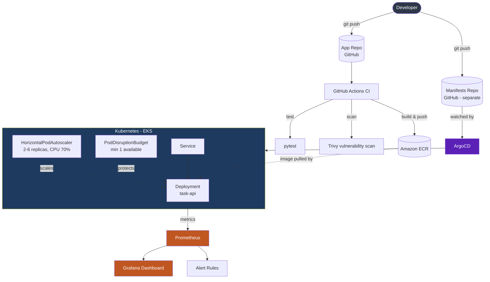

# Self-Healing GitOps Platform on AWS EKS

A production-style DevOps platform built end-to-end, by hand: infrastructure as code,
containerized delivery, GitOps deployment, autoscaling, and observability &mdash; on Amazon EKS.

Built while transitioning from a Helpdesk Support role into Cloud/DevOps. Every command in
this repo was run personally, every bug below was hit and debugged first-hand, and every
piece of infrastructure was torn down responsibly after use.

---

## Architecture



**Two self-healing mechanisms work together here:**
- **Kubernetes level** &mdash; if a pod crashes, the ReplicaSet controller creates a replacement automatically.
- **GitOps level** &mdash; if the *cluster itself* drifts from what Git declares (e.g. someone runs a manual `kubectl` change), ArgoCD detects and reverts it within seconds.

## Tech Stack

| Layer | Tools |
|---|---|
| Infrastructure as Code | Terraform, `terraform-aws-modules` (VPC, EKS) |
| Cloud | AWS (VPC, EKS, ECR, IAM, KMS) |
| Containers | Docker |
| CI/CD | GitHub Actions, Trivy |
| GitOps | ArgoCD |
| Orchestration | Kubernetes (EKS for production-parity work, minikube for local iteration) |
| Autoscaling | Horizontal Pod Autoscaler, PodDisruptionBudget |
| Observability | Prometheus, Grafana |
| App | Python (Flask) |

## What This Demonstrates

- **Infrastructure as Code** &mdash; VPC (public/private subnets across 2 AZs, NAT gateway), EKS cluster and managed node group, fully provisioned via Terraform using community modules.
- **Containerization** &mdash; Flask API packaged with a security-conscious Dockerfile: non-root user, `gunicorn` instead of the dev server, container health check.
- **CI/CD with security scanning** &mdash; every push runs tests, builds the image, scans it for vulnerabilities with Trivy, and pushes to Amazon ECR.
- **GitOps with ArgoCD** &mdash; deployment config lives in a [separate manifests repo](https://github.com/nidhiksha-ananth/gitops-eks-manifests), continuously watched and auto-synced. No manual `kubectl apply` after initial setup.
- **Rollback** &mdash; reverting a Git commit (`git revert`) automatically reverts the live deployment; verified end-to-end.
- **Drift correction (self-heal)** &mdash; manually changing the cluster outside of Git is detected and reverted by ArgoCD within seconds.
- **Autoscaling, proven under real load** &mdash; generated synthetic CPU load and watched the HPA scale replicas 2 &rarr; 4 as the 70% threshold was crossed, then scale back down automatically once load stopped.
- **Availability guarantees** &mdash; a PodDisruptionBudget ensures at least 1 pod stays available during voluntary disruptions.
- **Observability** &mdash; Prometheus + Grafana dashboard showing live cluster metrics, plus a working alert rule.
- **Cost-conscious cloud practice** &mdash; infrastructure destroyed after every session and verified clean via AWS CLI; local minikube used for iteration to avoid unnecessary cloud spend; a resource-heavy monitoring step was deliberately run on temporary real infrastructure rather than fought on a constrained laptop.

## Repository Structure

```
.
├── app/                       # Flask Task API
│   ├── app.py
│   ├── Dockerfile
│   ├── requirements.txt
│   └── tests/
├── .github/workflows/ci.yml   # CI/CD pipeline
├── vpc.tf, eks.tf, ecr.tf      # Terraform infrastructure
└── docs/                      # Notes, screenshots, troubleshooting log

gitops-eks-manifests/          # Separate repo, watched by ArgoCD
├── deployment.yaml
├── service.yaml
├── hpa.yaml
└── pdb.yaml
```

## Running It Yourself

**Infrastructure:**
```bash
terraform init
terraform apply
aws eks update-kubeconfig --region ap-south-1 --name gitops-eks-dev
```

**App + GitOps, locally on minikube:**
```bash
minikube start --driver=docker
minikube image build -t task-api:local ./app
helm install argocd argo/argo-cd --namespace argocd
# Create an ArgoCD Application pointing at the gitops-eks-manifests repo, path "."
```

**Try the self-healing behavior yourself:**
```bash
kubectl delete pod <any-task-api-pod>           # Kubernetes recreates it automatically
kubectl scale deployment task-api --replicas=1  # ArgoCD reverts it back to Git's declared count
```

**Try the autoscaling:**
```bash
kubectl run load-generator --image=busybox --restart=Never -it --rm -- \
  /bin/sh -c "while true; do wget -q -O- http://task-api.default.svc.cluster.local; done"
kubectl get hpa -w
```

## Real Issues Hit &amp; Fixed

This wasn't a smooth, linear build &mdash; and that's the point. Each of these was diagnosed and
resolved hands-on:

- **Deprecated EKS version blocked node group creation**, and a follow-up attempt to jump
  straight to a newer version failed too &mdash; EKS only allows sequential minor-version upgrades.
  Resolved by rebuilding cleanly on a supported version.
- **A pinned GitHub Action (`trivy-action`) became unresolvable** due to a real supply-chain
  security incident affecting older release tags. Repinned to a version confirmed safe
  post-incident.
- **ArgoCD reported "Synced" but a config change never actually applied.** Systematically ruled
  out Git content, the tracked revision, HPA conflicts, PVC caching, and three separate internal
  ArgoCD caches before finding the real cause: `service.yaml` had accidentally been created as a
  duplicate Deployment manifest instead of an actual Service &mdash; confirmed via ArgoCD's own
  `RepeatedResourceWarning`, initially dismissed as cosmetic.
- **ArgoCD's default Helm install (7 pods) was too heavy for an 8GB local machine**, causing
  `repo-server` to CrashLoopBackOff under memory pressure. Fixed with a custom Helm values file
  disabling unused components and setting explicit resource limits.
- **ArgoCD and the HPA fought over the same field** &mdash; ArgoCD tried to keep `replicas` matching
  Git while HPA tried to scale it dynamically. Resolved with ArgoCD's `ignoreDifferences` setting.
- **Grafana crash-looped even on properly resourced EKS nodes** &mdash; not a memory problem this
  time, but health-check probes timing out before a genuinely slow-starting container (with two
  init sidecars) finished booting. Fixed by extending probe timeouts, not adding more memory.
- **Found a real distributed-systems bug**: in-memory app state doesn't persist correctly across
  multiple Kubernetes replicas, since the Service load-balances across pods with separate memory.

Full day-by-day command log, troubleshooting notes, and screenshots: see `docs/`.

## Roadmap

- [x] Terraform: VPC + EKS
- [x] Docker + GitHub Actions CI/CD with security scanning
- [x] ArgoCD GitOps: sync, rollback, drift correction
- [x] Horizontal Pod Autoscaler + PodDisruptionBudget
- [x] Prometheus + Grafana monitoring with alerting
- [ ] AWS Cost Optimization companion project (Lambda-based auto-stop, budget alerts)

## Author

Built by Nidhiksha &mdash; transitioning into Cloud/DevOps from a Helpdesk Support background.
[LinkedIn](#) &middot; [GitHub](https://github.com/nidhiksha-ananth)
